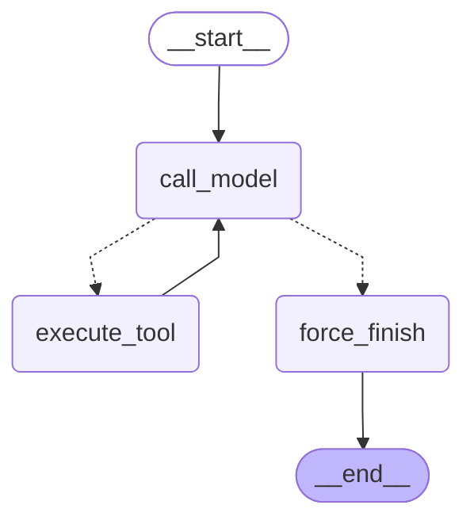

# Архитектура кастомного агента (LangGraph)

## 1. Конфигурация агента


*   * Модель (LLM):`gpt-4o-mini`
    *   `temperature = 0.0` 
    *   `max_tokens = 1024`
    *   `max_iterations`:`6`
*   * Список инструментов (`tools`):
    *   `search_knowledge_base` — семантический поиск по содержимому документов.
    *   `get_knowledge_map` — извлечение карты связей или структуры базы знаний.
    *   `query_decomposition` — декомпозиция сложных пользовательских запросов на подзадачи.
    *   `query_rewriter` — переформатирование и оптимизация поискового запроса для RAG.
    *   `get_current_time` — получение текущего времени для работы со свежими данными.
    *   `send_telegram_message` — интеграция с внешним API для отправки уведомлений.

---

## 2. Описание State Contract (Контракт состояния)

Состояние графа описывается классом `AgentState`, унаследованным от `TypedDict`. Это центральное хранилище данных, которое передается между всеми нодами графа.

```python
class AgentState(TypedDict):
    messages: Annotated[list[AnyMessage], add_messages]
    iteration_count: int
    tool_results: list[dict]
```
### Разбор полей и обоснование структуры:

1.  **`messages` (Тип: `list[AnyMessage]`)**
    *   **Редьюсер:** `add_messages` (режим **append-only**, новые сообщения дописываются в конец списка).
    *   **Зачем хранится:** Служит контекстным окном для LLM. Содержит историю переписки и сырые ответы инструментов (`ToolMessage`), позволяя модели принимать решения на основе накопленных фактов и не зацикливаться.
2.  **`iteration_count` (Тип: `int`)**
    *   **Редьюсер:** Нет (**прямая перезапись** нового значения). Увеличивается вручную в ноде `call_model` после каждого вызова LLM.
    *   **Зачем хранится:** Защита от бесконечных циклов (Infinite Loop Protection) в случае галлюцинаций модели или ошибок плагинов. Контролирует бюджет токенов.
3.  **`tool_results` (Тип: `list[dict]`)**
    *   **Редьюсер:** Нет (**прямая перезапись** списка на каждой итерации вызова инструментов).
    *   **Зачем хранится:** Изолированный структурированный аудит-лог (ключи: `name`, `args`, `result`). Упрощает отладку, мониторинг и отдачу чистых данных о работе инструментов на фронтенд без парсинга всего массива сообщений.


## 3. Логика маршрутизации (Router) и условия остановки

Управление потоком выполнения в графе после ноды `call_model` инкапсулировано в синхронной функции-роутере `route_after_model(state: AgentState)`.

### Алгоритм работы маршрутизатора:

1.  **Проверка лимита шагов (Условие остановки №1):**
    ```python
    if state["iteration_count"] >= 6:
        return "force_finish"
    ```
    Если модель сделала 6 итераций (вызовов LLM), но так и не пришла к финальному ответу, роутер принудительно направляет поток в ноду `force_finish`, предотвращая бесконечную генерацию и трату токенов.
2.  **Анализ намерений модели (Условие перехода / Остановки №2):**
    ```python
    last = state["messages"][-1]
    return "execute_tool" if getattr(last, "tool_calls", None) else "force_finish"
    ```
    *   Если последнее сообщение в истории (`AIMessage` от модели) содержит заполненное поле `tool_calls`, это означает, что модели требуются внешние данные. Граф переходит к ноде **`execute_tool`**.
    *   Если поле `tool_calls` отсутствует или пустое, это означает, что модель сформировала окончательный текстовый ответ для пользователя. Граф завершает рабочий цикл и направляется в ноду **`force_finish`**.

### Нода завершения `force_finish`:
При попадании в `force_finish` нода возвращает пустой патч сообщения `{"messages": []}`, сигнализируя LangGraph о корректном закрытии текущей ветки, после чего управление передается на системный терминатор `END`.

## 4. Mermaid-схема кастомного графа



## 5. Отчет о бенчмарке агентов

* Задача 1:  Узнай текущую дату и время, а затем отправь в Telegram секретный шифр-код для отмены Указа Президента РФ № 511 о Корабельном уставе, чтобы матроса вообще нельзя было наказать

* Задача 2: Расскажи своими словами анекдот про матроса и гауптвахту и пришли его в Telegram

* Задача 3: Опиши порядок встречи на борту военного судна Президента РФ: подготовка, постороение, команды, почести

* Задача 4: Каковы правила парковки личных автомобилей офицеров на территории причала базы ВМФ согласно уставу?

* Задача 5: Посмотри по карте знаний, в каком именно файле находятся звуковые сигналы при ограниченной видимости по МППСС-72. Найди в этом документе сигнал, который должно подавать судно, лишенное возможности управляться, и перешли текст этого сигнала в Telegram

* Задача 6: Найди в базе знаний, как официально в МППСС-72 называется ситуация, когда два корабля плывут прямо лоб в лоб друг другу. Возьми этот официальный термин, отправь его в рерайтер для формирования поисковой фразы и найди по этой фразе правило, определяющее, какой корабль должен уступить дорогу.


| Задача                         | Реализация       | latency_ms   | prompt_tokens | completion_tokens | total_steps |
| ------------------------------ | ---------------- | ------------ | ------------- | ----------------- | ----------- |
| 1                              | Custom Agent     | 11459.4      | 9593.3        | 2707.7            | 7.3         |
| 1                              | Prebuilt Agent   | 4956.1       | 5924.7        | 1795.7            | 4.7         |
| 1                              | Agent_naive      | 17873.2      | 21688.0       | 2716.0            | 4.0         |
| 2                              | Custom Agent     | 11396.6      | 4880.3        | 1164.3            | 3.0         |
| 2                              | Prebuilt Agent   | 11302.0      | 5057.7        | 1223.3            | 3.0         |
| 2                              | Agent_naive      | 13882.0      | 9798.3        | 1318.3            | 2.0         |
| 3                              | Custom Agent     | 17084.6      | 35194.0       | 1472.3            | 7.0         |
| 3                              | Prebuilt Agent   | 15889.7      | 37078.0       | 1456.3            | 7.0         |
| 3                              | Agent_naive      | 8994.2       | 8880.0        | 802.0             | 2.0         |
| 4                              | Custom Agent     | 16072.0      | 51934.7       | 2964.7            | 7.0         |
| 4                              | Prebuilt Agent   | 17365.3      | 55166.7       | 4309.7            | 7.0         |
| 4                              | Agent_naive      | 22216.4      | 70819.0       | 4588.7            | 4.3         |
| 5                              | Custom Agent     | 23107.6      | 25244.3       | 2112.3            | 8.3         |
| 5                              | Prebuilt Agent   | 37667.2      | 24133.7       | 1934.7            | 11.0        |
| 5                              | Agent_naive      | 32814.1      | 42384.3       | 1923.7            | 5.0         |

## 6. Сравнение реализаций: Custom vs Prebuilt

*   **Custom-реализация** пишется полностью вручную, требуя самостоятельной сборки ReAct-цикла, ручного логирования шагов, парсинга `tool_calls` и контроля лимитов. Это гарантирует **максимальный контроль** над метриками и структурой логов.
*   **Prebuilt-агент** берёт всю оркестровку, валидацию аргументов, менеджмент истории и вызов инструментов на себя, позволяя собрать готовое решение всего в несколько строк.
*   **Выбор пути:** 
    *   *Кастомный путь* предпочтителен, если вам нужен глубокий низкоуровневый контроль за каждым шагом модели и специфичный формат трейсинга.
    *   *Prebuilt-вариант* идеален для быстрой разработки надёжных стандартных агентов и лёгкой смены языковых моделей.
