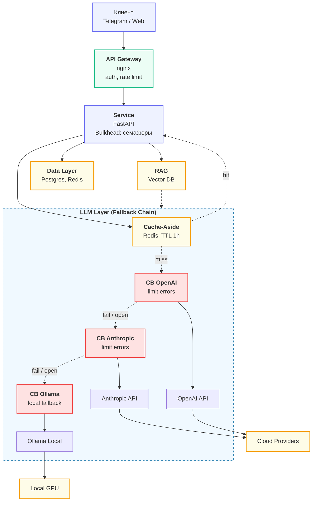

## ADR-001: Выбор паттерна взаимодействия
**Status:** Accepted (2026-04-XX)
**Context.** Проект — чат-бот с RAG-поиском. Ожидаемая
нагрузка — 10 сообщений/мин в пике, средний ответ — 300–500 токенов
(2–6 секунд генерации), бюджет $100/мес.
**Decision.** Выбран **Streaming через SSE**. Бот редактирует
сообщение по мере прихода токенов (паттерн edit-message).
**Consequences.**
- Плюсы: TTFT 200–600 мс — пользователь сразу видит реакцию.
- Минусы: на nginx нужно отключить proxy_buffering; FastAPI держит
открытое соединение 5–10 сек на каждого пользователя (но asyncio это держит).
**Alternatives.**
- Request-Response — отвергнут, 5–10 секунд молчания в чате — плохой UX.
- Queue-based — отвергнут, для интерактивного чата избыточно: добавляет polling
и убивает «печать в реальном времени».
## ADR-002: Стратегия fault tolerance
**Decision.** Primary — OpenAI gpt-5-mini (баланс цена/качество).
Fallback — Anthropic claude-sonnet-4-6. Tertiary — Ollama qwen3:32b
(локально, на случай полного отказа облаков).
Circuit Breaker — `aiobreaker`, fail_max=5, timeout=60s, **по одному на
провайдера**. Cache-Aside в Redis, TTL 1 час, ключ —
`sha256(model + messages + temperature)`.
**Consequences.** Доступность сервиса гарантируется даже при одновременном
падении OpenAI + Anthropic (Ollama держит UX «работаем в ограниченном режиме»).
Стоимость: дополнительные $5/мес за минимальный Anthropic-трафик и
self-hosted Ollama на VPS.

# Graceful Degradation: Стратегии и паттерны отказоустойчивости

Документ описывает логику «плавной деградации» системы при отказе отдельных слоев архитектуры **Gateway → Service → LLM → Data**.

---
## 1. Слой Gateway
*   **Сценарий:** Исчерпание соединений (Connection Exhaustion). Если Service начинает отвечать медленно, Gateway «забивается» открытыми соединениями и перестает принимать новых пользователей.
*   **Смягчающий паттерн:** `Bulkhead` + `Rate Limiting`.
*   **Graceful Degradation:** Шлюз ограничивает `max_connections` к бэкенду и жестко фильтрует входящий трафик по IP/ID.
    *   **Результат:** Система отсекает избыточную нагрузку на входе, не давая «положить» сетевую инфраструктуру.

## 2. Слой Service (FastAPI / Backend)
*   **Сценарий:** Бэкенд перегружен, возникла критическая ошибка или OOM (Out of Memory), сервис не отвечает.
*   **Смягчающий паттерн:** `Static Gateway Offloading` (Nginx / API Gateway).
*   **Graceful Degradation (Деградация):** Сервис переходит в режим **«Технического обслуживания»**.
    *   **Логика:** Шлюз (Gateway) фиксирует смерть бэкенда и, вместо стандартной ошибки 502, отдает легкую статическую HTML-страницу или JSON из кэша.
    *   **Результат:** Пользователь видит вежливое сообщение о работах, что снижает уровень негатива и предотвращает панику на стороне клиента.

## 3. Слой LLM (Внешние API)
*   **Сценарий:** Основной провайдер выдает ошибки или превышены лимиты (Rate Limits).
*   **Смягчающий паттерн:** `Fallback Chain` + `Circuit Breaker` (отдельный на каждого провайдера).
*   **Graceful Degradation (Деградация):** Сервис переходит в режим **«Резервной генерации»**.
    *   Основной LLM работает → полный ответ с contextual reasoning
    *   Основной упал, работает резервный LLM → ответ, возможно менее качественный
    *   Все LLM упали, работает кеш → похожий ответ из истории
    *   Кеш пуст, работает template → шаблонный ответ без LLM («Не могу ответить прямо сейчас. Попробуйте сформулировать иначе или напишите в поддержку»)
    *   Ничего не работает → честный 503 с Retry-After: 30
*  **Результат:** Пользователь получает хоть какой-то ответ вместо бесконечного ожидания таймаута.
## 4. Слой Data 
### Postgres / Vector DB
*   **Сценарий:** База данных истории чатов или векторное хранилище (RAG) недоступны или отвечают слишком медленно.
*   **Смягчающий паттерн:** `Circuit Breaker` + `Fallback to Zero-Context`.
*   **Graceful Degradation (Деградация):** Сервис переходит в режим **«Без памяти»**.
    *   **Логика:** Вместо блокировки всего запроса из-за ошибки БД, приложение отключает поиск контекста и загрузку истории.
    *   **Результат:** LLM получает только текущий вопрос пользователя. Пользователь получает ответ с пометкой: *«История чата и актуальные данные временно недоступны, отвечаю на основе базовых знаний»*.

## Redis
*   **Сценарий:** Сбой Redis. Происходит «Cache Miss Storm» — вся нагрузка мгновенно переходит на дорогой LLM-слой и основную БД.
*   **Смягчающий паттерн:** `Bulkhead` (Изоляция ресурсов).
*   **Graceful Degradation (Деградация):** Сервис переходит в режим **«Ограниченных ресурсов»**.
    *   **Логика:** Паттерн Bulkhead (через семафоры в FastAPI) жестко ограничивает количество одновременных запросов к LLM (например, не более 10 слотов).
    *   **Результат:** Система не пытается обработать все запросы сразу и не падает от нехватки памяти. Часть пользователей получает быстрый отказ (503), но для остальных сервис продолжает работать.

