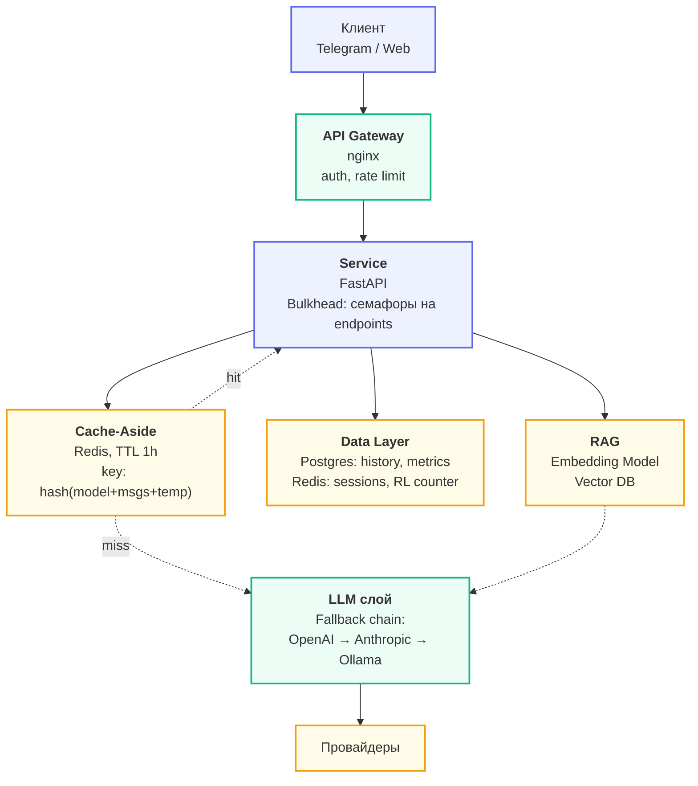

## ADR-001: Выбор паттерна взаимодействия
**Status:** Accepted (2026-04-XX)
**Context.** Проект — чат-бот в Telegram для технической поддержки. Ожидаемая
нагрузка — 100 сообщений/мин в пике, средний ответ — 300–500 токенов
(2–6 секунд генерации), бюджет $30/мес.
**Decision.** Выбран **Streaming через SSE**. Telegram-бот редактирует
сообщение по мере прихода токенов (паттерн edit-message).
**Consequences.**
- Плюсы: TTFT 200–600 мс — пользователь сразу видит реакцию.
- Минусы: на nginx нужно отключить proxy_buffering; FastAPI держит
открытое соединение 5–10 сек на каждого пользователя (но asyncio это держит).
**Alternatives.**
- Request-Response — отвергнут, 5–10 секунд молчания в чате — плохой UX.
- Queue-based — отвергнут, для интерактивного чата избыточно: добавляет polling
и убивает «печать в реальном времени».
## ADR-002: Стратегия fault tolerance
**Decision.** Primary — OpenAI gpt-5-mini (баланс цена/качество).
Fallback — Anthropic claude-sonnet-4-6. Tertiary — Ollama qwen3:32b
(локально, на случай полного отказа облаков).
Circuit Breaker — `aiobreaker`, fail_max=5, timeout=60s, **по одному на
провайдера**. Cache-Aside в Redis, TTL 1 час, ключ —
`sha256(model + messages + temperature)`.
**Consequences.** Доступность сервиса гарантируется даже при одновременном
падении OpenAI + Anthropic (Ollama держит UX «работаем в ограниченном режиме»).
Стоимость: дополнительные $5/мес за минимальный Anthropic-трафик и
self-hosted Ollama на VPS.
