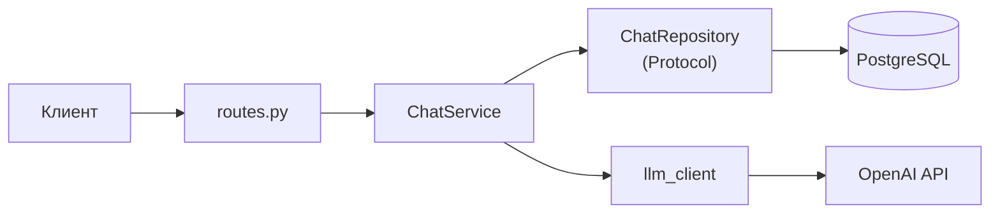

## Высокоуровневая архитектура Chat Service



## Стратегия контекста Hybrid (summary + последние M)

- **Контроль размера контекста LLM**
- **Снижение стоимости запросов к LLM**
- **Быстрее обработка запросов**
- **Сохранение долгосрочного контекста**
- **Стабильное качество ответов**
- **Предсказуемое потребление ресурсов**

# Инструкция по переключению хранилища чатов

## Переменная `CHAT_REPOSITORY`

Выбор реализации хранилища выполняется через переменную окружения `CHAT_REPOSITORY`.

Для использования файлового хранилища:
```env
CHAT_REPOSITORY=json
```

Для использования PostgreSQL:
```env
CHAT_REPOSITORY=postgres
```

---

## Процесс переключения хранилища

Выполните следующие шаги для изменения типа хранилища:

1. **Остановить** запущенное приложение.
2. **Изменить** значение переменной `CHAT_REPOSITORY` в файле `.env`.

**Пример изменений:**
```env
# Было
CHAT_REPOSITORY=json

# Стало
CHAT_REPOSITORY=postgres
```

3. **Перезапустить** приложение, чтобы новые настройки вступили в силу.

 
# Перечень эндпоинтов API чатов

---

## 1. Создание или получение чата

* **Метод:** `POST`
* **Путь:** `/chats`
* **Описание:** Создает новый чат или возвращает существующий на основе ID владельца и интерфейса.

### Пример запроса (curl)
```bash
curl -X POST "http://localhost:8000/chats" \
     -H "Content-Type: application/json" \
     -d '{
       "owner_external_id": "user_12345",
       "interface": "web_tg",
       "system_prompt": "Ты — полезный ассистент."
     }'
```

### Пример успешного ответа (JSON)
```json
{
  "chat_id": "3fa85f64-5717-4562-b3fc-2c963f66afa6"
}
```

---

## 2. Метаданные чата

* **Метод:** `GET`
* **Путь:** `/chats/{chat_id}`
* **Описание:** Возвращает информацию о конкретном чате по его UUID.

### Пример запроса (curl)
```bash
curl -X GET "http://localhost:8000/chats/3fa85f64-5717-4562-b3fc-2c963f66afa6"
```

### Пример успешного ответа (JSON)
```json
{
  "id": "3fa85f64-5717-4562-b3fc-2c963f66afa6",
  "owner_external_id": "user_12345",
  "interface": "web_tg",
  "created_at": "2026-08-07T22:00:00Z"
}
```

---

## 3. Отправка сообщения (SSE стриминг)

* **Метод:** `POST`
* **Путь:** `/chats/{chat_id}/messages`
* **Описание:** Отправляет сообщение в чат и возвращает ответ от модели в виде потока Server-Sent Events (SSE).

### Пример запроса (curl)
```bash
curl -X POST "http://localhost:8000/chats/3fa85f64-5717-4562-b3fc-2c963f66afa6/messages" \
     -H "Content-Type: application/json" \
     -N \
     -d '{
       "content": "Привет! Расскажи короткую шутку."
     }'
```
> **Примечание:** Флаг `-N` (`--no-buffer`) отключает буферизацию ответа в curl, позволяя видеть поток токенов в реальном времени.

### Пример успешного ответа (Текстовый поток)
```text
data: {"text": "Привет"}

data: {"text": "!"}

data: {"text": " Как я могу помочь?"}

data: [DONE]
```

---

## 4. Получение истории сообщений

* **Метод:** `GET`
* **Путь:** `/chats/{chat_id}/messages`
* **Описание:** Возвращает список сообщений чата с возможностью ограничения количества.
* **Query параметры:** `limit` (по умолчанию: 50, минимум: 1, максимум: 50).

### Пример запроса (curl)
```bash
curl -X GET "http://localhost:8000/chats/3fa85f64-5717-4562-b3fc-2c963f66afa6/messages?limit=20"
```

### Пример успешного ответа (JSON)
```json
[
  {
    "id": 1,
    "role": "user",
    "content": "Привет! Расскажи короткую шутку.",
    "created_at": "2026-08-07T22:01:00Z"
  },
  {
    "id": 2,
    "role": "assistant",
    "content": "Привет! Как я могу помочь?",
    "created_at": "2026-08-07T22:01:02Z"
  }
]
```

---

## 5. Очистка истории (soft delete)

* **Метод:** `DELETE`
* **Путь:** `/chats/{chat_id}/messages`
* **Описание:** Скрывает или помечает удаленной историю сообщений в указанном чате.

### Пример запроса (curl)
```bash
curl -X DELETE "http://localhost:8000/chats/3fa85f64-5717-4562-b3fc-2c963f66afa6/messages"
```

### Пример успешного ответа (JSON)
```json
{
  "status": "ok"
}
```

